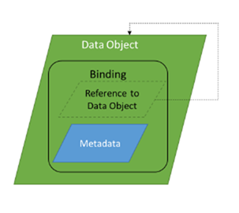
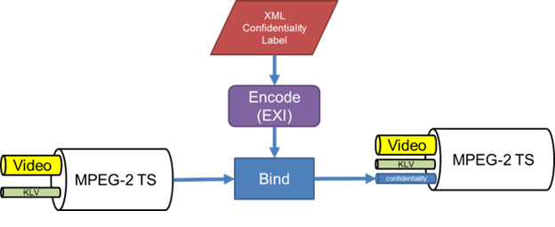
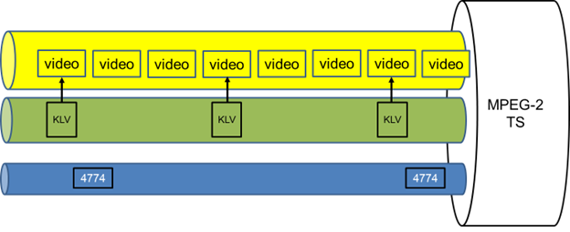

# STANAG 4609 Binding Profile

## 1. Introduction

This proposed profile describes a method to bind a STANAG 4774 Confidentiality Metadata Label [1] to a STANAG 4609 Motion Imagery 
stream [5].  The method is based on the Embedded binding approach outlined in STANAG 4778 Metadata Binding Mechanism [2]. 
In this approach, the data object contains the metadata, where the metadata is the Confidentiality Metadata Label, and the data 
object is the Motion Imagery stream.  In this standard, the reference to the data object is optional.



**Figure 1.** The figure shows the embedded binding that STANAG 4778 [3] describes.

## 2. Identification

The profile for STANAG 4609 Motion Imagery stream is uniquely identified by the Canonical Identifier shown in Table 1.

| Type | Identifier |
|------|------------|
|Canonical Identifier | urn:nato:stanag:4778:profile:4609 |
|Version Identifier | urn:nato:stanag:4778:profile:4609:2.0|

**Table 1.** Profile Identifiers

It is recognized that this profile may evolve during its review cycle.  For example, a review might identify:

•	Changes to STANAG 4609 standard.

•	Improvements to the existing profiles based upon operational feedback.

Therefore, this version of the profile is uniquely identified by the Version Identifier shown in Table 1.
Subsequent versions of this profile will maintain the same Canonical Identifier but define a new Version Identifier.

## 3. Standards

[1]	STANAG 4774, _Confidentiality Metadata Label Syntax_, Brussels, Belgium

[2]	STANAG 4778, _Metadata Binding Mechanism_, Brussels, Belgium

[3]	AAP-03, _Directive of the Production, Maintenance and Management of NATO Standardization Documents_, Edition K, Version 1, February 2018

[4]	IETF RFC 2119, _Key words for the use in RFCs to Indicate Requirement Levels_, S Bradner, Harvard University, March 1997

[5]	STANAG 4609, _NATO Digital Motion Imagery Standard_, Edition 5. 2020

[6]	ISO/IEC 13818-1. _Generic coding of moving pictures and associated audio information: Systems_. 2015

[7]	SMPTE RP 217, _Non-synchronized Mapping of KLV Packets into MPEG-2 System Streams_. 2001

[8]	MISB ST 1402.2, _MPEG-2 Transport Stream for Class 1/Class 2 Motion Imagery, Audio, and Metadata_. 2016

[9]	_Efficient XML Interchange (EXI) Format 1.0_, Second Edition. s.l.:W3C, 2014

[10]	MISB MISP-2019-1, _Motion Imagery Profile_. 2019

[11]	_MPEG Transport Stream Identifiers_. [Online] https://smpte-ra.org/registered-mpeg-ts-ids

## 4. Notational Conventions

The keywords “MUST”, “MUST NOT”, “REQUIRED”, “SHALL”, “SHALL NOT”, “SHOULD”, “SHOULD NOT”, “RECOMMENDED”, “MAY”,
and “OPTIONAL” in this document are to be interpreted as described in Reference [4].

## 5. STANAG 4609 Profile Structure

The method outlined in this profile leverages existing mechanisms described in multiple standards.  
The approach is to multiplex the Confidentiality Metadata Label into the MPEG-2 TS [6] container using the 
asynchronous metadata carriage method as described in SMPTE RP 217 [7] and MISB ST 1402 [8]. To reduce the size 
of the Confidentiality Metadata Label, systems MAY encode the 
Confidentiality Metadata Label to a binary format as outlined in W3C Recommendation, 
Efficient XML Interchange (EXI) Format [9].  Binding the text-based XML Confidentiality Metadata Label to the 
Transport stream is allowed. The profile provides guidance on label frequency so the stream containing the 
Confidentiality Metadata Label consumes minimal bandwidth.



**Figure 2.** The basic approach is where the label is multiplexed into a MPEG-2 TS stream.

### 5.1 Label Carriage Mechanism

STANAG 4609 [5] references MISB MISP-2019.1 [10] as its standard.  In STANAG 4609 [5], the primary container 
format to encapsulate metadata with compressed video and audio is MPEG-2 Transport Stream [6].  
The Asynchronous Stream Multiplex Method, as outlined in MISB ST 1402 [8], SHALL be used in this profile.

**Requirement**
```
The systems that bind the Confidentiality Metadata Label to a MPEG-2 Transport Stream SHALL use the 
Asynchronous Stream Multiplex Method as outlined in MISB ST 1402 [8].
```



**Figure 3.** A MPEG-2 Transport Stream encapsulates compressed video frames where the KLV metadata is multiplex using
 the synchronous method and the Confidentiality Metadata Label is multiplex using the asynchronous method..

### 5.2 Program Map Table

The __Program Map Table__ is a data structure inside a MPEG-2 Transport Stream [6] that describes the composition of a 
program.  A program can comprise multiple streaming elements, including video, audio, and metadata.  This section 
covers the requirements for signaling that a MPEG-2 Transport Stream contains a Confidentiality Metadata Label
program element.

The table shows the program element signaling that a program contains a Confidentiality Metadata Label in the 
section where the program map table enumerates all the streaming elements in a program.


```
    SYNTAX                                  VALUE                BITS
____________________________________________________________________________________________________
Program_element() {
    stream_type                             0x06                 8
    reserved                                111                  3
    elementary_PID                          <Assigned>           13
    reserved                                1111                 4
    ES_info_length                          0x1A (26)            12
    registration_descriptor(){
        descriptor_tag                      0x05                 8
        descriptor_length                   0x08                 8
        format_identifier                   <$XML|$EXI>          32
        additional_identification_info      0x34373734 (4774)    32
    }
    Metadata_descriptor(){
        descriptor_tag                      0x26                 8
        descriptor_length                   0x0E                 8
        metadata_application_format         0x0104               16
        metadata_format                     0xFF                 8
        metadata_format_identifier          <$XML|$EXI>          32
        metadata_service_id                 0x01                 8
        decoder_config_flags                001                  3
        DSM-CC_flag                         0 (false)            1
        reserved                            1111                 4
        decoder_config_length               0x04                 8
        decoder_config_byte                 0x34373734 (4774)    32
    }
}
```
**Table 2.**  Program element signaling that a program contains a Confidentiality Metadata Label stream.

#### 5.2.1 Semantic Definitions of the Fields

This sub-section covers the semantic definitions of the fields and their value that Table 2 outlines.  
The highlighted statements indicate requirements.

**stream_type:** `The system binding the label to a transport stream SHALL set the stream_type field to the value of 0x06 in the program map table.`  As per MISB ST 1402 [8], SMPTE RP 217 [7], and ISO/IEC 13818-1 [6], this signals that the elementary stream contains “PES packets containing private data.”  It also indicates the transport stream inserted the label using the asynchronous metadata multiplex method. 

**descriptor_tag:** The field value indicates the descriptor type defined by the transport stream standard [6].

**descriptor_length:**  An 8-bit field specifying the number of bytes of the descriptor following this field.

**format_identifier:**  `The systems binding the label to a transport stream SHALL set the format_identifier field to
$XML if the label is text-based XML format; otherwise, set the field to $EXI if the label is EXI encoded in the registration_descriptor`.  Presently, the four-byte value is not included in the list of registered MPEG TS 
identifiers [11] and may need to be registered in the future. 

**additional_identification_info:** `The systems binding the label to a transport stream SHALL set the additional_identification_info field to 4774 (0x34 0x37 0x37 0x34) in the registration_descriptor.`  This field informs the label’s XML schema is defined by STANAG 4774 [1].  In the future, this field could signal other XML schemas, such as STANAG 4778 [2] or NSA ISM.

**metadata_application_format:**  `The systems binding the label to a transport stream SHALL set the metadata_application_format field to 0x01 0x04 in the Metadata_descriptor.`  MISB ST 1402 [8] already defined values for this field ranging from 0x01 0x00 to 0x01 0x03.  Therefore, this standard increased the last byte by avoiding conflicting with values in MISB ST 1402 [8].

**metadata_format:** An 8-bit field that indicates the metadata encoding.  Set the field to 0xFF, which signals the decoder to read the metadata_format_identifier field [6] for label encoding.

**metadata_format_identifier:**  `The systems binding the label to a transport stream SHALL set the 
metadata_format_identifier field to $XML if the label is text-based XML format; otherwise, set the field to 
$EXI if the label is EXI encoded in the Metadata_descriptor.`  Presently, the four-byte value is not included in the
list of registered MPEG TS identifiers [11], and the future may need to be registered. 

**metadata_service_id:**  `The systems binding the label to a transport stream SHALL set the metadata_service_id field to 0x01.`  In MISB ST 1402, this field has been assigned the value of 0x00.   Therefore, this standard increases the value by one, so it does not conflict with the KLV metadata service.

**decoder_config_byte:** `The systems binding the label to a transport stream SHALL set the 
additional_identification_info field to the value of 4774 (0x34 0x37 0x37 0x34) in the Metadata_descriptor.`
This field informs the label’s XML schema is defined by STANAG 4774 [1].  In the future, this field could signal 
other XML schemas, such as STANAG 4778 [2] or NSA ISM.

### 5.3 Label Frequency
This section guides the appropriate frequency to embed a Confidentiality Metadata Label into a transport stream.  
The system binding the label to the transport stream should adjust the frequency based on the video bitrate.  
If the video bitrate is low, the frequency should be low.  One approach is to establish the label frequency to be no
greater than a prescribed ratio of the video bitrate.  The formula is as follows:

<pre>
Label Freq (Hz) = round (Video Bitrate x Percent / Label Size)
</pre>

For example, if a system streams video at an average bitrate of 4,147 kbps, the label size is 335 bytes (2680 bits), 
and label overhead should be no greater than 1% of the video bitrate then:

<pre>
35 Hz = round (4147 x 0.01 / 2680)
</pre>

The below tables show different label frequencies based on video bitrate and percentage overhead.

|  Resolution (WxH@Framerate)    | Video Bitrate (kbits/s)| Label Frequency |
|--------------------------------|------------------------|-----------------|
| 1920x1080@30 | 9,331 | 35 |
| 1280x720@30 | 4,1477 | 15 |
| 720x480@30 | 1,555 | 6 |
| 960x540@30 | 2,332 | 9 |
| 640x360@30 | 1,036 | 4 |
| 360x240@30 | 388 | 1 |
| 180x120@30 | 97 | 0.36 or every 3 seconds|

**Table 3.** Label frequency at 1% of video bitrate where the label size is 335 bytes.

|  Resolution (WxH@Framerate)    | Video Bitrate (kbits/s)| Label Frequency |
|--------------------------------|------------------------|-----------------|
| 1920x1080@30 | 9,331 | 3 |
| 1280x720@30 | 4,1477 | 3 |
| 720x480@30 | 1,555 | 0.5 or every 2 seconds |
| 960x540@30 | 2,332 | 1 |
| 640x360@30 | 1,036 | 0.39 or every 3 seconds |
| 360x240@30 | 388 | 0.13 or every 8 seconds |
| 180x120@30 | 97 | 0.036 or every 28 seconds|

**Table 4.** Label frequency at 0.1% of video bitrate where the label size is 335 bytes.